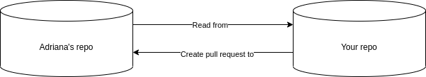
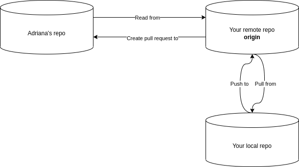
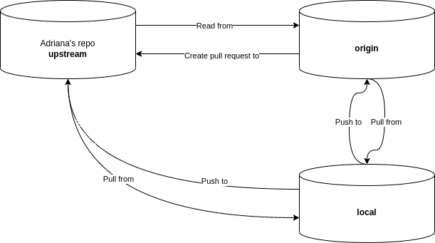
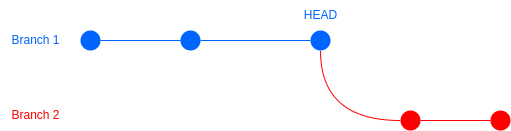
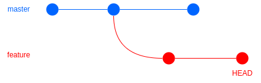
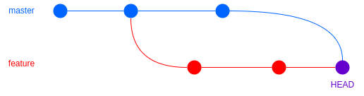
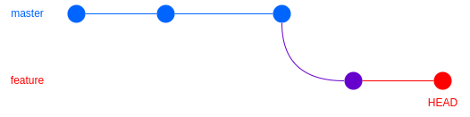
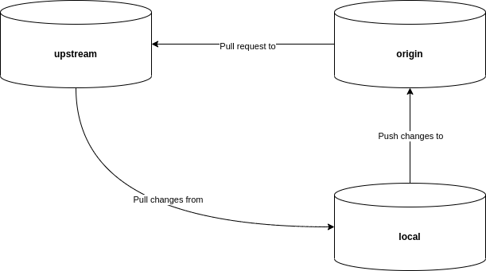

# Phuong's Guide to Developing HydraBike with GitHub

Hi Team, this is a brief instruction on using GitHub to develop our HydraBike project. Let's get started!

## Relevant Concepts

### Repository

Remember when we forked from Adriana's branch at the beginning of this semester? What we did then were creating a new repo linked to our account with the exact same Git history as Adriana's. It looks something like this:



When you do `git clone your_repo_url` at the beginning of this semester, you created a **local repository** on your computer that is linked to your **remote repository**, and this remote repository is named **origin**. This is where all the **origin** in Git command comes from!



You can verify the link to your **origin** repo with:\
`git remote -v`

And you might get something like this:

```
origin	git@github.com:pmphan/valetbike.git (fetch)
origin	git@github.com:pmphan/valetbike.git (push)
upstream	git@github.com:abeltranandrade/valetbike.git (fetch)
upstream	git@github.com:abeltranandrade/valetbike.git (push)
```

This tell me that my local repository is linked to git@github.com:pmphan/valetbike.git. Git will fetch and push to this repo when I issue the appropriate command. 

But wait, what is **upstream**? As you can see from the link, the repository named **upstream** is just Adriana's repo. So actually my local repository is tracking *two* remote repositories at the same time!



**NOTE:** Git also uses the term *upstream* to refer to the remote branch that your local branch is tracking! These two are not the same.

### Fast forward

Let's say we have a git history like this:



And you are on *branch_1*, at the HEAD position. You now want to merge *branch_2* into *branch_1*, so you call `git merge branch_2`. By default, git will use fast-forward behavior, which means it figured out it can just move the HEAD position to the top of *branch_2*. This process creates no new commit.


### Merge

A common situation is while working on a feature branch, you want to incorporate the changes from the `master`. But it has been a while since you checked out from `master` and now it has new commits. It might look something like this:



When you call `git merge`, git will see that it's not possible to fast-forward, so instead it will create a new merge commit, like so:



Merge is a bit safer than rebase, since it does not modify any existing commits.

### Rebase

The problem with merge is you don't get to have a linear git history, which some people might prefer. We then have the ability to rebase, which will instead update the feature branch like so:



It just moved any new commits of `master` to the base of `feature`, so it now looks like you checked out from `master` latest commits. The caveat is it will modify the first diverged commit in the `feature` branch, mark in purple. That branch will contain the change of any new commits from `master` and changes made by itself.

## Our Git workflow

Unfortunately I feel like we picked a very awkward workflow by having everyone maintaining their own fork. But we can still make it work! It will look something like this:



### Syncing your `master` branch with the upstream

This is my recommended setup: I set up my local `master` to track the `upstream/master` branch, and whenever I want to develop a new feature, I *sync my master branch with the upstream's master branch* and then I checkout a new branch from that synced master branch.

To do this we need to do the following steps:

`git checkout master`

This make sure you are on branch `master` of your local repository.

`git status`

This step is optional. Don't need to do it if you're sure the following things are true: Make sure your local `master` is tracking `origin/master`. Additionally, make sure there is no message saying something along the line of "Your branch and the remote branch have diverged". *There shouldn't be any if we follow this workflow.*

`git fetch upstream master`

This lines tell me to *fetch any changes* from the `master` branch of the upstream (Adriana's) repo. That's it, we don't do any update to our local repository (yet).

`git merge upstream/master --ff-only`

Merge any changes from upstream to our master branch. The `--ff-only` argument is there to make sure that we don't create a new merge commit. If it cannot fast-forward, the merge will instead fail. *It should not happen if we follow this flow strictly.*

**NOTE:** It might be convenient for you to set it up so that you simply *push* to origin and *pull* from remote. See [GitHub's support for triangle workflow](https://github.blog/2015-07-29-git-2-5-including-multiple-worktrees-and-triangular-workflows/#improved-support-for-triangular-workflows). Personally I prefer more fine-grained control, and I dislike accidentally fetching some branch from upstream that I don't need.

**Adriana's privelege:** Since you have the definitive `master` branch, all you have to do is `git checkout master` followed by `git pull`.

### Starting a new feature

Whenever you start developing a new feature, **always make sure you update your branch with upstream `master` branch**. Update often! Understanding people's code and using it makes things *a lot* easier to resolve merge conflicts.

Do the above steps to sync your `master` branch with the upstream. After everything is synced up, checkout a new branch from the master branch with:

`git checkout -b branch_name`

And now you can start developing on this branch! My branch naming scheme is `feature/feature-name` for feature branch, `fix/bug-name` for hot fix, and maybe some other like `chore/chore-name` or `deploy/deploy-task` depending on the situation.

### Pushing new feature and creating pull request

To avoid creating conflicts with the pull requests, do the following steps:

First sync your `master` with upstream `master` following the above instructions, then go back to the branch you were working on with:

`git checkout branch_name`

Rebase any changes onto this branch to make sure we have a linear commit history with:

`git rebase master`

Add `--interactive` argument if you want more fine-grained control. Resolve any merge-conflicts that come up. In the end, make sure everything is finished and there're no rebase in progress with `git status`.

Now you can push this branch from your *local* repo to the GitHub's remote *origin* repo. If this is the first time you push on this branch and it's tracking no upstream branch yet, do

`git push --set-upstream origin HEAD`

If this branch is already tracking an *origin* branch with the same name, do

`git push -f`

The `-f` argument is there because after rebasing, we have modified our Git history. We won't be able to push unless we force overwrite. This is a problem if two people are working on the same branch, and maybe the other person has pushed something to your local branch you haven't updated yet, but since you are the only one working on your fork, this should be okay!

**NOTE:** The above steps should be done often, even if you are not ready to merge your changes yet. I would say after about 2 or 3 major pull requests to `master` to make sure you stay up to date and don't have like 15 commits with conflicts to go through every time you rebase.

After you have done those above steps, you should be able to create a pull request **from your feature branch to upstream `master` branch** with no conflicts. Note how we don't merge anything to your local's `master` branch. This is because as we have said, we are going to use the local's `master` to track the upstream `master`. We only change it if there are changes to upstream `master`.

**NOTE:** Pull request can be conflicts-free even if you have not done the above steps. For example if you and the upstream `master` both modified different files since you two diverge, or if the upstream `master` hasn't been updated at all since you last sync with it. If you are sure your pull request can be conflicts-free, you can ignore the above steps.

### Two people working on the same feature

We have two options if you guys want 2 people to work on the same feature.

1. Create a new remote that's linked to your friend's remote repo:\
`git remote add {newremotename} https://github.com/{username}/{reponame}.git`.
1. Create a new feature branch on the `upstream` repo and work from that. You can replace `master` in the above instruction with this branch's name.

## The End

That's it. I hope things are a bit clearer now after reading throught this guide. The steps outlined in here are not be-all-and-end-all, you are welcomed to experiment and find a better flow that fits you. If run into any problems, or if you fall into any *this should not happen* situation above, contact me so I can help you resolve it (and update this document)!
